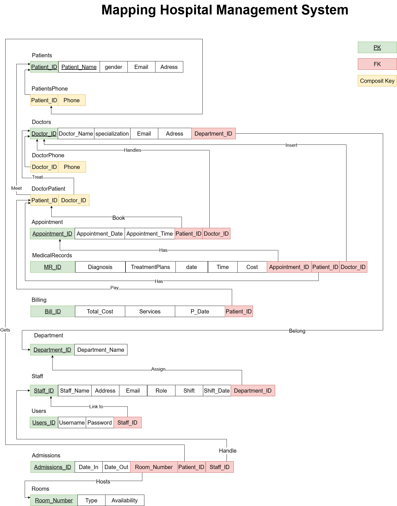

# SQL Database Project: Hospital Management System

## PDF Documentation 

[SQL Database Project : Hospital Management System](./PDF/SQL-Database-Project.pdf)

## ERD 


## Mapping 




## Normalization

**UNF**
	
**Patient Table:**

|PatientID|PatientName|Gender|Address|PhoneNumber          |
|---------|-----------|------|-------|---------------------|
|1        |Salim      |Male  |Muscat |99887766 , 98989898  |
|2        |Aisha      |Female|Muscat |99887767             |
|3        |Omar       |Male  |Muscat |99887768, 99889988   |

**1st Normal Form (1NF):**

**Patient Table:**

|PatientID|PatientName|Gender|Address|
|---------|-----------|------|-------|
|1        |Salim      |Male  |Muscat |
|2        |Aisha      |Female|Muscat |
|3        |Omar       |Male  |Muscat |

**PatientPhone Table:**

|PatientID|PhoneNumber |
|---------|------------|
|1        |99887766    |
|1        |98989898    |
|2        |99887767    |
|3        |99887768    |
|3        |99889988    |


**2nd Normal Form (2NF):**
- The PatientPhone table is already in 2NF as it has a composite key (PatientID, PhoneNumber) and no partial dependencies.
**3rd Normal Form (3NF):**
- already in 3NF as there are no transitive dependencies.

---


**Doctor Table:**

|DoctorID |DoctorName |Specialization |PhoneNumber         |Email            |Address          |
|---------|-----------|---------------|---------------------|-----------------|---------------- |
|1        |Dr. Ahmed  |Cardiology     |99887766 , 98989898  |ahmed@gmail.com  |Muscat           |
|2        |Dr. Fatima |Neurology      |99887767             |fatima@gmail.com |Muscat           |
|3        |Dr. Ali    |Pediatrics     |99887768, 99889988   |ali@gmail.com    |Salalah          |


**1st Normal Form (1NF):**


**Doctor Table:**


|DoctorID |DoctorName |Specialization |Email            |Address          |
|---------|-----------|---------------|-----------------|-----------------|
|1        |Dr. Ahmed  |Cardiology     |ahmed@gmail.com  |Muscat           |
|2        |Dr. Fatima |Neurology      |fatima@gmail.com |Muscat           |
|3        |Dr. Ali    |Pediatrics     |ali@gmail.com    |Salalah          |

**DoctorPhone Table:**

|DoctorID |PhoneNumber |
|---------|------------|
|1        |99887766    |
|1        |98989898    |
|2        |99887767    |
|3        |99887768    |
|3        |99889988    |

---
**Appointment Table:**

|AppointmentID |PatientID |DoctorID |AppointmentDate |AppointmentTime |
|-------------|----------|---------|-----------------|-----------------|
|1            |1         |1        |2023-10-01      |10:00 AM         |
|2            |2         |2        |2023-10-02      |11:00 AM         |
|3            |3         |3        |2023-10-03      |12:00 PM         |


**MedicalRecord Table:**

|MR_ID |PatientID |DoctorID |AppointmentID |Diagnosis       |TreatmentPlans       |Date      |Time     |Cost |
|-------|----------|---------|---------------|-----------------|----------------------|----------|---------|-----|
|1      |1         |1        |1              |Flu              |Hydration       |2023-10-01|10:30 AM |50   |
|2      |2         |2        |2              |Migraine          |Medication   |2023-10-02|11:30 AM |75   |
|3      |3         |3        |3              |Fever             |Medication  |2023-10-03|12:30 PM |60   |

---

**Bill Table:**

|BillID   |PatientID |TotalAmount |PaymentStatus  |
|---------|----------|------------|---------------|
|1        |1         |50          |Paid           |
|2        |2         |75          |Unpaid         |
|3        |3         |60          |Paid           |

---

**Department Table:**

|DepartmentID |DepartmentName |
|---------|----------------|
|1        |Cardiology      |
|2        |Neurology       |
|3        |Pediatrics      |

---

**Staff Table:**

|StaffID  |StaffName|Role         |PhoneNumber           |Email            |Address          |
|---------|---------|-------------|----------------------|-----------------|-----------------|
|1        |Sara     |Admin        |98777777              |sara@gmail.com   | Muscat          |
|2        |Faisal   |Reception    |95115915,99663322     |faisal@gmail.com | Muscat          |

**1st Normal Form (1NF):**

**Staff Table:**

|StaffID  |StaffName|Role         |Email            |Address          |Shift  |Shift_Date |DepartmentID |	
|---------|---------|-------------|-----------------|-----------------|-------|-----------|--------------|
|1        |Sara     |Admin        |sara@gmail.com   | Muscat          |Night  |2023-10-01 |1            |
|2        |Faisal   |Reception    |faisal@gmail.com | Muscat          |Morning|2023-10-02 |2            |


**StaffPhone Table:**

|StaffID  |PhoneNumber |
|---------|------------|
|1        |98777777    |
|2        |95115915    |
|2        |99663322    |

---

**User Table:**

|UserID   |Username  |Password  |
|---------|----------|----------|
|1        |admin     |admin123  |
|2        |reception |reception123|

---

**Admission Table:**

|AdmissionID |DateIn |DateOut |RoomNumber |PatientID |StuffID |
|-------------|-------|--------|-----------|----------|--------|
|1            |2023-10-01|2023-10-05|101       |1         |1       |
|2            |2023-10-02|2023-10-06|102       |2         |2       |


---

**Room Table:**

|RoomNumber |RoomType    |Availability |
|-----------|------------|-------------|
|101        |ICU         |True    |
|102        |General     |False |
|103        |Private     |True    |


------


## SQL Script 

```sql

