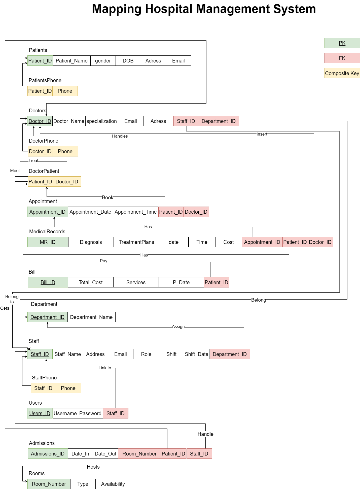
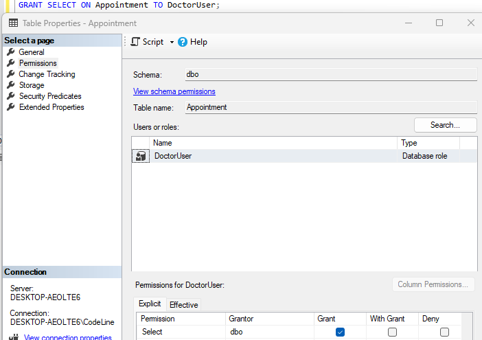
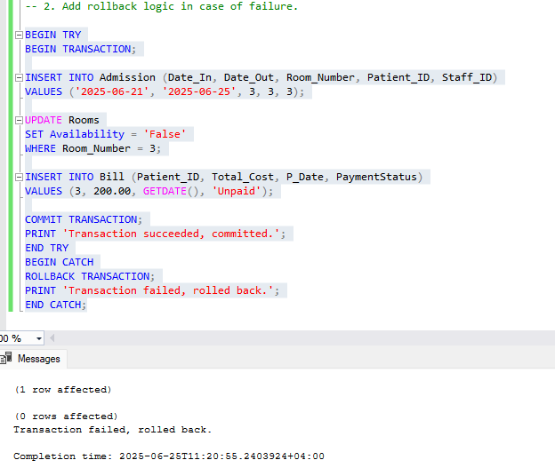

# SQL Database Project: Hospital Management System

## PDF Documentation 

[SQL Database Project : Hospital Management System](./PDF/SQL-Database-Project.pdf)

## ERD 


## Mapping 




## Normalization

**UNF**
	
**Patient Table:**

|PatientID|PatientName|Gender|Address|PhoneNumber          |
|---------|-----------|------|-------|---------------------|
|1        |Salim      |Male  |Muscat |99887766 , 98989898  |
|2        |Aisha      |Female|Muscat |99887767             |
|3        |Omar       |Male  |Muscat |99887768, 99889988   |

**1st Normal Form (1NF):**

**Patient Table:**

|PatientID|PatientName|Gender|Address|
|---------|-----------|------|-------|
|1        |Salim      |Male  |Muscat |
|2        |Aisha      |Female|Muscat |
|3        |Omar       |Male  |Muscat |

**PatientPhone Table:**

|PatientID|PhoneNumber |
|---------|------------|
|1        |99887766    |
|1        |98989898    |
|2        |99887767    |
|3        |99887768    |
|3        |99889988    |


**2nd Normal Form (2NF):**
- The PatientPhone table is already in 2NF as it has a composite key (PatientID, PhoneNumber) and no partial dependencies.
**3rd Normal Form (3NF):**
- already in 3NF as there are no transitive dependencies.

---


**Doctor Table:**

|DoctorID |DoctorName |Specialization |PhoneNumber         |Email            |Address          |
|---------|-----------|---------------|---------------------|-----------------|---------------- |
|1        |Dr. Ahmed  |Cardiology     |99887766 , 98989898  |ahmed@gmail.com  |Muscat           |
|2        |Dr. Fatima |Neurology      |99887767             |fatima@gmail.com |Muscat           |
|3        |Dr. Ali    |Pediatrics     |99887768, 99889988   |ali@gmail.com    |Salalah          |


**1st Normal Form (1NF):**


**Doctor Table:**


|DoctorID |DoctorName |Specialization |Email            |Address          |
|---------|-----------|---------------|-----------------|-----------------|
|1        |Dr. Ahmed  |Cardiology     |ahmed@gmail.com  |Muscat           |
|2        |Dr. Fatima |Neurology      |fatima@gmail.com |Muscat           |
|3        |Dr. Ali    |Pediatrics     |ali@gmail.com    |Salalah          |

**DoctorPhone Table:**

|DoctorID |PhoneNumber |
|---------|------------|
|1        |99887766    |
|1        |98989898    |
|2        |99887767    |
|3        |99887768    |
|3        |99889988    |

---
**Appointment Table:**

|AppointmentID |PatientID |DoctorID |AppointmentDate |AppointmentTime |
|-------------|----------|---------|-----------------|-----------------|
|1            |1         |1        |2023-10-01      |10:00 AM         |
|2            |2         |2        |2023-10-02      |11:00 AM         |
|3            |3         |3        |2023-10-03      |12:00 PM         |


**MedicalRecord Table:**

|MR_ID |PatientID |DoctorID |AppointmentID |Diagnosis       |TreatmentPlans       |Date      |Time     |Cost |
|-------|----------|---------|---------------|-----------------|----------------------|----------|---------|-----|
|1      |1         |1        |1              |Flu              |Hydration       |2023-10-01|10:30 AM |50   |
|2      |2         |2        |2              |Migraine          |Medication   |2023-10-02|11:30 AM |75   |
|3      |3         |3        |3              |Fever             |Medication  |2023-10-03|12:30 PM |60   |

---

**Bill Table:**

|BillID   |PatientID |TotalAmount |PaymentStatus  |
|---------|----------|------------|---------------|
|1        |1         |50          |Paid           |
|2        |2         |75          |Unpaid         |
|3        |3         |60          |Paid           |

---

**Department Table:**

|DepartmentID |DepartmentName |
|---------|----------------|
|1        |Cardiology      |
|2        |Neurology       |
|3        |Pediatrics      |

---

**Staff Table:**

|StaffID  |StaffName|Role         |PhoneNumber           |Email            |Address          |
|---------|---------|-------------|----------------------|-----------------|-----------------|
|1        |Sara     |Admin        |98777777              |sara@gmail.com   | Muscat          |
|2        |Faisal   |Reception    |95115915,99663322     |faisal@gmail.com | Muscat          |

**1st Normal Form (1NF):**

**Staff Table:**

|StaffID  |StaffName|Role         |Email            |Address          |Shift  |Shift_Date |DepartmentID |	
|---------|---------|-------------|-----------------|-----------------|-------|-----------|--------------|
|1        |Sara     |Admin        |sara@gmail.com   | Muscat          |Night  |2023-10-01 |1            |
|2        |Faisal   |Reception    |faisal@gmail.com | Muscat          |Morning|2023-10-02 |2            |


**StaffPhone Table:**

|StaffID  |PhoneNumber |
|---------|------------|
|1        |98777777    |
|2        |95115915    |
|2        |99663322    |

---

**User Table:**

|UserID   |Username  |Password  |
|---------|----------|----------|
|1        |admin     |admin123  |
|2        |reception |reception123|

---

**Admission Table:**

|AdmissionID |DateIn |DateOut |RoomNumber |PatientID |StuffID |
|-------------|-------|--------|-----------|----------|--------|
|1            |2023-10-01|2023-10-05|101       |1         |1       |
|2            |2023-10-02|2023-10-06|102       |2         |2       |


---

**Room Table:**

|RoomNumber |RoomType    |Availability |
|-----------|------------|-------------|
|101        |ICU         |True    |
|102        |General     |False |
|103        |Private     |True    |


------


## SQL Script 

```sql
-- Create database 
create database HospitalManagmentDB;

-- use database
use HospitalManagmentDB;

------------

-- Patients Table
CREATE TABLE Patient (
    Patient_ID INT PRIMARY KEY IDENTITY(1,1),
    Patient_Name VARCHAR(100) NOT NULL,
    Gender VARCHAR(10) CHECK (Gender IN ('Male', 'Female')),
    Address VARCHAR(255) NOT NULL,
	Email VARCHAR(100) NOT NULL UNIQUE
);
-- PatientPhone Table
CREATE TABLE PatientPhone (
    Patient_ID INT,
    Phone VARCHAR(15),
    PRIMARY KEY (Patient_ID, Phone),
    FOREIGN KEY (Patient_ID) REFERENCES Patient(Patient_ID) ON DELETE CASCADE ON UPDATE CASCADE
);


-- Doctors Table
CREATE TABLE Doctor (
    Doctor_ID INT PRIMARY KEY IDENTITY(1,1),
    Doctor_Name VARCHAR(100) NOT NULL,
    Specialization VARCHAR(100) NOT NULL,
    Email VARCHAR(100) NOT NULL UNIQUE,
    Address VARCHAR(255) NOT NULL
);

-- DoctorPhone Table
CREATE TABLE DoctorPhone (
    Doctor_ID INT,
    Phone VARCHAR(15),
    PRIMARY KEY (Doctor_ID, Phone),
    FOREIGN KEY (Doctor_ID) REFERENCES Doctor(Doctor_ID) ON DELETE CASCADE ON UPDATE CASCADE
);

-- Appointments Table
CREATE TABLE Appointment (
    Appointment_ID INT PRIMARY KEY IDENTITY(1,1),
    Patient_ID INT NOT NULL,
    Doctor_ID INT NOT NULL,
    Appointment_Date DATE NOT NULL,
    Appointment_Time TIME NOT NULL,
    FOREIGN KEY (Patient_ID) REFERENCES Patient(Patient_ID) ON DELETE CASCADE ON UPDATE CASCADE,
    FOREIGN KEY (Doctor_ID) REFERENCES Doctor(Doctor_ID) ON DELETE CASCADE ON UPDATE CASCADE
);


-- Medical Records Table
CREATE TABLE MedicalRecord (
    MR_ID INT PRIMARY KEY IDENTITY(1,1),
    Patient_ID INT NOT NULL,
    Doctor_ID INT NOT NULL,
    Appointment_ID INT NOT NULL,
    Diagnosis VARCHAR(255) NOT NULL,
    TreatmentPlans VARCHAR(255),
    Date DATE NOT NULL,
    Time TIME NOT NULL,
    Cost DECIMAL(10, 2) CHECK (Cost >= 0),
    FOREIGN KEY (Patient_ID) REFERENCES Patient(Patient_ID) ON DELETE CASCADE ON UPDATE CASCADE,
    FOREIGN KEY (Doctor_ID) REFERENCES Doctor(Doctor_ID) ON DELETE NO ACTION ,
    FOREIGN KEY (Appointment_ID) REFERENCES Appointment(Appointment_ID) ON DELETE NO ACTION
);

-- Bills Table
CREATE TABLE Bill (
    Bill_ID INT PRIMARY KEY IDENTITY(1,1),
    Patient_ID INT NOT NULL,
    Total_Cost DECIMAL(10, 2) CHECK (Total_Cost >= 0),
	P_Date DATE NOT NULL,
    PaymentStatus VARCHAR(50) DEFAULT 'Unpaid' CHECK (PaymentStatus IN ('Paid', 'Unpaid')),
    FOREIGN KEY (Patient_ID) REFERENCES Patient(Patient_ID) ON DELETE CASCADE ON UPDATE CASCADE
);

-- Departments Table
CREATE TABLE Department (
    Department_ID INT PRIMARY KEY IDENTITY(1,1),
    Department_Name VARCHAR(100) NOT NULL UNIQUE
);

-- ADDING  Department_ID AS FK IN Doctor Table
ALTER TABLE Doctor
ADD Department_ID INT NOT NULL FOREIGN KEY (Department_ID) REFERENCES Department(Department_ID)


-- Staff Table
CREATE TABLE Staff (
    Staff_ID INT PRIMARY KEY IDENTITY(1,1),
    Staff_Name VARCHAR(100) NOT NULL,
    Role VARCHAR(100) NOT NULL,
    Email VARCHAR(100) NOT NULL UNIQUE,
    Address VARCHAR(255) NOT NULL,
    Shift VARCHAR(50) CHECK (Shift IN ('Morning', 'Evening', 'Night')),
    Shift_Date DATE,
    Department_ID INT NOT NULL,
    FOREIGN KEY (Department_ID) REFERENCES Department(Department_ID)
);


CREATE TABLE StaffPhone (
    Staff_ID INT,
    Phone VARCHAR(15),
    PRIMARY KEY (Staff_ID, Phone),
    FOREIGN KEY (Staff_ID) REFERENCES Staff(Staff_ID)
);

-- Users
CREATE TABLE Users (
    User_ID INT PRIMARY KEY IDENTITY(1,1),
    Username VARCHAR(100) NOT NULL UNIQUE,
    Password VARCHAR(100) NOT NULL
);

-- Rooms
CREATE TABLE Rooms (
    Room_Number INT PRIMARY KEY IDENTITY(1,1),
    Type VARCHAR(50) CHECK (Type IN ('ICU', 'General', 'Private')),
    Availability VARCHAR(10) DEFAULT 'True'
);

-- Admissions
CREATE TABLE Admission (
    Admission_ID INT PRIMARY KEY IDENTITY(1,1),
    Date_In DATE NOT NULL,
    Date_Out DATE,
    Room_Number INT NOT NULL,
    Patient_ID INT NOT NULL,
    Staff_ID INT NOT NULL,
    FOREIGN KEY (Room_Number) REFERENCES Rooms(Room_Number)ON DELETE NO ACTION ,
    FOREIGN KEY (Patient_ID) REFERENCES Patient(Patient_ID) ON DELETE CASCADE ON UPDATE CASCADE,
    FOREIGN KEY (Staff_ID) REFERENCES Staff(Staff_ID) ON DELETE NO ACTION
);

-- DoctorPatient 

CREATE TABLE DoctorPatient (
    Doctor_ID INT NOT NULL,
    Patient_ID INT NOT NULL,
    PRIMARY KEY (Doctor_ID, Patient_ID),
    FOREIGN KEY (Doctor_ID) REFERENCES Doctor(Doctor_ID) ON DELETE CASCADE ON UPDATE CASCADE,
    FOREIGN KEY (Patient_ID) REFERENCES Patient(Patient_ID) ON DELETE CASCADE ON UPDATE CASCADE
);


```
---------------------------------------


## Adding Data into Tables 

```sql


-- Patient Table 

INSERT INTO Patient (Patient_Name, Gender, Address, Email) VALUES
('Ali Said', 'Male', 'Muscat', 'ali.said@gmail.com'),
('Fatma Al Balushi', 'Female', 'Sohar', 'fatma.balushi@gmail.com'),
('Mohammed Nasser', 'Male', 'Nizwa', 'm.nasser@gmail.com'),
('Salma Al Zadjali', 'Female', 'Ibri', 'salma.zadjali@gmail.com'),
('Hamed Al Amri', 'Male', 'Sur', 'hamed.amri@gmail.com'),
('Aisha Al Siyabi', 'Female', 'Barka', 'a.siyabi@gmail.com'),
('Saeed Al Farsi', 'Male', 'Rustaq', 'saeed.farsi@gmail.com'),
('Mona Al Busaidi', 'Female', 'Muscat', 'mona.busaidi@gmail.com'),
('Rashid Al Rawahi', 'Male', 'Suwaiq', 'rashid.rawahi@gmail.com'),
('Layla Al Hinai', 'Female', 'Salalah', 'layla.hinai@gmail.com'),
('Omar Al Abri', 'Male', 'Bahla', 'omar.abri@gmail.com'),
('Huda Al Mahrouqi', 'Female', 'Shinas', 'huda.mahrouqi@gmail.com'),
('Talib Al Habsi', 'Male', 'Izki', 'talib.habsi@gmail.com'),
('Rania Al Riyami', 'Female', 'Seeb', 'rania.riyami@gmail.com'),
('Majid Al Azri', 'Male', 'Bidbid', 'majid.azri@gmail.com'),
('Noura Al Lawati', 'Female', 'Amerat', 'noura.lawati@gmail.com'),
('Badr Al Nabhani', 'Male', 'Khasab', 'badr.nabhani@gmail.com'),
('Dina Al Shukaili', 'Female', 'Adam', 'dina.shukaili@gmail.com'),
('Khalid Al Maamari', 'Male', 'Al Suwaiq', 'khalid.maamari@gmail.com'),
('Shaima Al Maskari', 'Female', 'Mutrah', 'shaima.maskari@gmail.com');


-- PatientPhone Table

INSERT INTO PatientPhone (Patient_ID, Phone) VALUES
(1, '96890123401'),
(2, '96890123402'),
(3, '96890123403'),
(4, '96890123404'),
(5, '96890123405'),
(6, '96890123406'),
(7, '96890123407'),
(8, '96890123408'),
(9, '96890123409'),
(10, '96890123410'),
(11, '96890123411'),
(12, '96890123412'),
(13, '96890123413'),
(14, '96890123414'),
(15, '96890123415'),
(16, '96890123416'),
(17, '96890123417'),
(18, '96890123418'),
(19, '96890123419'),
(20, '96890123420');


Select * FROM Patient
SELECT * FROM PatientPhone

-- Department Table 
INSERT INTO Department (Department_Name) VALUES
('Cardiology'),
('Neurology'),
('Pediatrics'),
('Orthopedics'),
('Oncology'),
('Radiology'),
('Emergency'),
('Pathology'),
('Anesthesiology'),
('Dermatology'),
('Gastroenterology'),
('Endocrinology'),
('Psychiatry'),
('Urology'),
('Nephrology'),
('Ophthalmology'),
('ENT'),
('General Surgery'),
('Obstetrics and Gynecology'),
('Physical Therapy');

SELECT * FROM Department


-- Doctor table

INSERT INTO Doctor (Doctor_Name, Specialization, Email, Address, Department_ID) VALUES
('Dr. Salim Al Harthy', 'Cardiology', 'salim.harthy@hospital.com', 'Muscat', 1),
('Dr. Aisha Al Busaidi', 'Neurology', 'aisha.busaidi@hospital.com', 'Sohar', 2),
('Dr. Faisal Al Habsi', 'Pediatrics', 'faisal.habsi@hospital.com', 'Nizwa', 3),
('Dr. Mona Al Riyami', 'Orthopedics', 'mona.riyami@hospital.com', 'Ibri', 4),
('Dr. Ahmed Al Farsi', 'Oncology', 'ahmed.farsi@hospital.com', 'Sur', 5),
('Dr. Huda Al Azri', 'Cardiology', 'huda.azri@hospital.com', 'Muscat', 1),
('Dr. Khalfan Al Maamari', 'Neurology', 'khalfan.maamari@hospital.com', 'Suwaiq', 2),
('Dr. Samira Al Siyabi', 'Pediatrics', 'samira.siyabi@hospital.com', 'Salalah', 3),
('Dr. Majid Al Amri', 'Orthopedics', 'majid.amri@hospital.com', 'Rustaq', 4),
('Dr. Laila Al Hinai', 'Oncology', 'laila.hinai@hospital.com', 'Seeb', 5);

-- DoctorPhone Table 

INSERT INTO DoctorPhone (Doctor_ID, Phone) VALUES
(1, '96891234501'),
(2, '96891234502'),
(3, '96891234503'),
(4, '96891234504'),
(5, '96891234505'),
(6, '96891234506'),
(7, '96891234507'),
(8, '96891234508'),
(9, '96891234509'),
(10, '96891234510');

SELECT * FROM Doctor
SELECT * FROM DoctorPhone
-- DoctorPatient Table

INSERT INTO DoctorPatient (Doctor_ID, Patient_ID) VALUES
(1, 1),
(1, 3),
(2, 2),
(2, 4),
(3, 5),
(3, 6),
(4, 7),
(4, 8),
(5, 9),
(5, 10),
(1, 11),
(2, 12),
(3, 13),
(4, 14),
(5, 15),
(1, 16),
(2, 17),
(3, 18),
(4, 19),
(5, 20);

SELECT * FROM DoctorPatient

-- Staff Table

INSERT INTO Staff (Staff_Name, Role, Email, Address, Shift, Shift_Date, Department_ID) VALUES
('Huda Al Kindi', 'Nurse', 'huda.kindi@hospital.com', 'Ibri', 'Morning', '2025-06-24', 1),
('Yousef Al Rawahi', 'Receptionist', 'yousef.rawahi@hospital.com', 'Salalah', 'Evening', '2025-06-24', 2),
('Mariam Al Busaidi', 'Admin', 'mariam.busaidi@hospital.com', 'Muscat', 'Night', '2025-06-25', 3),
('Fahad Al Mahrouqi', 'Nurse', 'fahad.mahrouqi@hospital.com', 'Nizwa', 'Morning', '2025-06-25', 4),
('Latifa Al Shukaili', 'Receptionist', 'latifa.shukaili@hospital.com', 'Suwaiq', 'Evening', '2025-06-25', 5),
('Omar Al Amri', 'Nurse', 'omar.amri@hospital.com', 'Amerat', 'Night', '2025-06-26', 1),
('Samira Al Rawahi', 'Admin', 'samira.rawahi@hospital.com', 'Sohar', 'Morning', '2025-06-26', 2),
('Majid Al Lawati', 'Receptionist', 'majid.lawati@hospital.com', 'Muscat', 'Evening', '2025-06-26', 3),
('Rania Al Kharusi', 'Nurse', 'rania.kharusi@hospital.com', 'Sur', 'Night', '2025-06-27', 4),
('Salim Al Hinai', 'Admin', 'salim.hinai@hospital.com', 'Khasab', 'Morning', '2025-06-27', 5);

-- StaffPhone Table 
INSERT INTO StaffPhone (Staff_ID, Phone) VALUES
(1, '96892345601'),
(2, '96892345602'),
(3, '96892345603'),
(4, '96892345604'),
(5, '96892345605'),
(6, '96892345606'),
(7, '96892345607'),
(8, '96892345608'),
(9, '96892345609'),
(10, '96892345610');

SELECT * FROM Staff
SELECT * FROM StaffPhone

-- Appointment Table

INSERT INTO Appointment (Patient_ID, Doctor_ID, Appointment_Date, Appointment_Time) VALUES
(1, 1, '2025-06-01', '09:00'),
(2, 2, '2025-06-02', '10:30'),
(3, 3, '2025-06-03', '11:00'),
(4, 4, '2025-06-04', '08:30'),
(5, 5, '2025-06-05', '09:15'),
(6, 6, '2025-06-06', '10:45'),
(7, 7, '2025-06-07', '09:30'),
(8, 8, '2025-06-08', '11:15'),
(9, 9, '2025-06-09', '08:00'),
(10, 10, '2025-06-10', '10:00'),
(11, 1, '2025-06-11', '09:00'),
(12, 2, '2025-06-12', '10:30'),
(13, 3, '2025-06-13', '11:00'),
(14, 4, '2025-06-14', '08:30'),
(15, 5, '2025-06-15', '09:15'),
(16, 6, '2025-06-16', '10:45'),
(17, 7, '2025-06-17', '09:30'),
(18, 8, '2025-06-18', '11:15'),
(19, 9, '2025-06-19', '08:00'),
(20, 10, '2025-06-20', '10:00');

SELECT * FROM Appointment

-- MedicalRecord Table


INSERT INTO MedicalRecord (Patient_ID, Doctor_ID, Appointment_ID, Diagnosis, TreatmentPlans, Date, Time, Cost) VALUES
(1, 1, 1, 'Flu', 'hydration', '2025-06-01', '09:00', 20.00),
(2, 2, 2, 'Migraine', 'Painkillers', '2025-06-02', '10:30', 30.00),
(3, 3, 3, 'Fever', 'Paracetamol', '2025-06-03', '11:00', 25.00),
(4, 4, 4, 'Sprain', 'Physiotherapy', '2025-06-04', '08:30', 40.00),
(5, 5, 5, 'Cancer Screening', 'Lab tests', '2025-06-05', '09:15', 120.00),
(6, 6, 6, 'Heart Pain', 'ECG', '2025-06-06', '10:45', 150.00),
(7, 7, 7, 'Cough', 'Syrup', '2025-06-07', '09:30', 15.00),
(8, 8, 8, 'Back Pain', 'X-Ray', '2025-06-08', '11:15', 70.00),
(9, 9, 9, 'Fatigue', 'Blood Test', '2025-06-09', '08:00', 90.00),
(10, 10, 10, 'Headache', 'Painkillers', '2025-06-10', '10:00', 30.00),
(11, 1, 11, 'Fever', 'Panadol', '2025-06-11', '09:00', 25.00),
(12, 2, 12, 'Stress', 'Rest', '2025-06-12', '10:30', 45.00),
(13, 3, 13, 'Ear Infection', 'Antibiotics', '2025-06-13', '11:00', 40.00),
(14, 4, 14, 'Fracture', 'Casting', '2025-06-14', '08:30', 110.00),
(15, 5, 15, 'Cancer', 'Chemo Session', '2025-06-15', '09:15', 300.00),
(16, 6, 16, 'Arrhythmia', 'Monitoring', '2025-06-16', '10:45', 180.00),
(17, 7, 17, 'Diarrhea', 'Fluids', '2025-06-17', '09:30', 20.00),
(18, 8, 18, 'Injury', 'Wound Dressing', '2025-06-18', '11:15', 50.00),
(19, 9, 19, 'Fatigue', 'Tests', '2025-06-19', '08:00', 90.00),
(20, 10, 20, 'Anxiety', 'Counseling', '2025-06-20', '10:00', 60.00);

SELECT * FROM MedicalRecord

-- Bill Table 

INSERT INTO Bill (Patient_ID, Total_Cost, P_Date, PaymentStatus) VALUES
(1, 20.00, '2025-06-01', 'Paid'),
(2, 30.00, '2025-06-02', 'Paid'),
(3, 25.00, '2025-06-03', 'Unpaid'),
(4, 40.00, '2025-06-04', 'Paid'),
(5, 120.00, '2025-06-05', 'Unpaid'),
(6, 150.00, '2025-06-06', 'Paid'),
(7, 15.00, '2025-06-07', 'Paid'),
(8, 70.00, '2025-06-08', 'Unpaid'),
(9, 90.00, '2025-06-09', 'Paid'),
(10, 30.00, '2025-06-10', 'Paid'),
(11, 25.00, '2025-06-11', 'Paid'),
(12, 45.00, '2025-06-12', 'Unpaid'),
(13, 40.00, '2025-06-13', 'Paid'),
(14, 110.00, '2025-06-14', 'Paid'),
(15, 300.00, '2025-06-15', 'Unpaid'),
(16, 180.00, '2025-06-16', 'Paid'),
(17, 20.00, '2025-06-17', 'Paid'),
(18, 50.00, '2025-06-18', 'Unpaid'),
(19, 90.00, '2025-06-19', 'Paid'),
(20, 60.00, '2025-06-20', 'Paid');

SELECT * FROM Bill


-- Rooms Table 

INSERT INTO Rooms (Type, Availability) VALUES
('ICU', 'True'),
('General', 'True'),
('Private', 'True'),
('ICU', 'False'),
('General', 'True'),
('Private', 'False'),
('ICU', 'True'),
('General', 'False'),
('Private', 'True'),
('ICU', 'True');

SELECT * FROM Rooms

-- Admission Table


INSERT INTO Admission (Date_In, Date_Out, Room_Number, Patient_ID, Staff_ID) VALUES
('2025-06-01', '2025-06-05', 1, 1, 1),
('2025-06-02', '2025-06-06', 2, 2, 2),
('2025-06-03', '2025-06-07', 3, 3, 3),
('2025-06-04', '2025-06-08', 4, 4, 4),
('2025-06-05', '2025-06-09', 5, 5, 5),
('2025-06-06', '2025-06-10', 6, 6, 6),
('2025-06-07', '2025-06-11', 7, 7, 7),
('2025-06-08', '2025-06-12', 8, 8, 8),
('2025-06-09', '2025-06-13', 9, 9, 9),
('2025-06-10', '2025-06-14', 10, 10, 10),
('2025-06-11', '2025-06-15', 1, 11, 1),
('2025-06-12', '2025-06-16', 2, 12, 2),
('2025-06-13', '2025-06-17', 3, 13, 3),
('2025-06-14', '2025-06-18', 4, 14, 4),
('2025-06-15', '2025-06-19', 5, 15, 5),
('2025-06-16', '2025-06-20', 6, 16, 6),
('2025-06-17', '2025-06-21', 7, 17, 7),
('2025-06-18', '2025-06-22', 8, 18, 8),
('2025-06-19', '2025-06-23', 9, 19, 9),
('2025-06-20', '2025-06-24', 10, 20, 10);

SELECT * FROM Admission

-- Users Table

INSERT INTO Users (Username, Password) VALUES
('admin1', 'Pass@123'),
('admin2', 'Pass@456'),
('admin3', 'Pass@789'),
('user1', 'User@123'),
('user2', 'User@456'),
('user3', 'User@789'),
('nurse1', 'Nurse@123'),
('nurse2', 'Nurse@456'),
('doctor1', 'Doc@123'),
('reception', 'Recep@123');


SELECT * FROM Users
```
------------------------------------------------

## Queries (DQL)
 1. List all patients who visited a certain doctor.
```sql

SELECT p.Patient_Name, d.Doctor_Name
FROM Patient p
INNER JOIN DoctorPatient dp ON p.Patient_ID = dp.Patient_ID
INNER JOIN Doctor d ON dp.Doctor_ID = d.Doctor_ID
WHERE d.Doctor_Name = 'Dr. Salim Al Harthy';
```

2. Count of appointments per department.

```sql
SELECT d.Department_Name, COUNT(a.Appointment_ID) AS Appointment_Count
FROM Appointment a
INNER JOIN Doctor d ON a.Doctor_ID = d.Doctor_ID
GROUP BY d.Department_Name;
```
3. Retrieve doctors who have more than 5 appointments in a month.
```sql

SELECT Doctor_Name,MONTH(a.Appointment_Date) AS Month,COUNT(*) AS Appointment_Count
FROM Appointment a
INNER JOIN Doctor d ON a.Doctor_ID = d.Doctor_ID
GROUP BY  d.Doctor_Name, MONTH(a.Appointment_Date)
HAVING COUNT(*) > 1;

```

4. Use JOINs across 3–4 tables.

```sql
SELECT p.Patient_Name, d.Doctor_Name, a.Appointment_Date, a.Appointment_Time, m.Diagnosis
FROM Patient p
INNER JOIN Appointment a ON p.Patient_ID = a.Patient_ID
INNER JOIN Doctor d ON a.Doctor_ID = d.Doctor_ID
INNER JOIN MedicalRecord m ON a.Appointment_ID = m.Appointment_ID
WHERE p.Patient_Name = 'Ali Said';
```

5. Use GROUP BY, HAVING, and aggregate functions.
```sql
SELECT d.Specialization, COUNT(*) AS Total_Doctors
FROM Doctor d
GROUP BY d.Specialization
HAVING COUNT(*) > 1;

```
6. Use SUBQUERIES and EXISTS.

```sql

-- SUBQUERY to find patients with appointments in 2025-06-16
SELECT p.Patient_Name
FROM Patient p
WHERE p.Patient_ID IN (SELECT a.Patient_ID FROM Appointment a
WHERE a.Appointment_Date ='2025-06-16');

-- EXISTS to check if a patient has any appointments
SELECT p.Patient_Name
FROM Patient p
WHERE EXISTS ( SELECT * FROM Appointment a WHERE a.Patient_ID = p.Patient_ID);


```
----------------------------------

## Functions & Stored Procedures

1. Scalar function to calculate patient age from DOB.
```sql
CREATE FUNCTION dbo.CalculateAge(@DOB DATE)
RETURNS INT
AS
BEGIN
DECLARE @Age INT;
SET @Age = DATEDIFF(YEAR, @DOB, GETDATE());
RETURN @Age;
END;

-- calling the function
SELECT dbo.CalculateAge('1990-01-01') AS Age;
```

2. Stored procedure to admit a patient (insert to Admissions, update Room availability).

```sql
CREATE PROCEDURE AdmitPatient
@Patient_ID INT,@Room_Number INT,
@Date_In DATE,@Date_Out DATE,@Staff_ID INT
AS
BEGIN

-- Insert into Admission table
INSERT INTO Admission (Date_In, Date_Out, Room_Number, Patient_ID, Staff_ID)
VALUES (@Date_In, @Date_Out, @Room_Number, @Patient_ID, @Staff_ID);
        
-- Update Room availability
UPDATE Rooms
SET Availability = 'False'
WHERE Room_Number = @Room_Number;
END;
-- calling the procedure
EXEC AdmitPatient @Patient_ID = 1, @Room_Number = 1, @Date_In = '2025-06-01', @Date_Out = '2025-06-05', @Staff_ID = 1;

```


3. Procedure to generate invoice (insert into Billing based on treatments).

```sql
CREATE PROCEDURE GenerateInvoice
@Patient_ID INT,
@Total_Cost DECIMAL(10, 2),
@PaymentStatus VARCHAR(50)
AS
BEGIN

-- Insert into Bill table
INSERT INTO Bill (Patient_ID, Total_Cost, P_Date, PaymentStatus)
VALUES (@Patient_ID, @Total_Cost, GETDATE(), @PaymentStatus);
END;
    
    
-- calling the procedure
EXEC GenerateInvoice @Patient_ID = 1, @Total_Cost = 200.00, @PaymentStatus = 'Paid';
```

4. Procedure to assign doctor to department and shift.

```sql
CREATE PROCEDURE AssignDoctorToDepartment
@Doctor_ID INT,
@Department_ID INT,
@Shift VARCHAR(50),
@Shift_Date DATE
AS
BEGIN

-- Update Doctor table with Department and Shift
UPDATE Doctor
SET Department_ID = @Department_ID
WHERE Doctor_ID = @Doctor_ID;

-- Update Staff table with Shift and Shift_Date
UPDATE Staff
SET Shift = @Shift, Shift_Date = @Shift_Date
WHERE Staff_ID = (SELECT Staff_ID FROM Doctor WHERE Doctor_ID = @Doctor_ID);
END;

-- calling the procedure
EXEC AssignDoctorToDepartment @Doctor_ID = 1, @Department_ID = 1, @Shift = 'Morning', @Shift_Date = '2025-06-26';

```
----------------------------------------------

## Triggers

1. After insert on Appointments → auto log in MedicalRecords.

```sql
CREATE TRIGGER trg_AfterInsertAppointment
ON Appointment
AFTER INSERT
AS
BEGIN
INSERT INTO MedicalRecord (Patient_ID, Doctor_ID, Appointment_ID, Diagnosis, TreatmentPlans, Date, Time, Cost)
SELECT a.Patient_ID,a.Doctor_ID,a.Appointment_ID,'Initial Checkup',NULL,GETDATE(), GETDATE(), 0.00 
FROM inserted a;
END;


-- calling the trigger
INSERT INTO Appointment (Patient_ID, Doctor_ID, Appointment_Date, Appointment_Time)
VALUES (1, 1, '2025-06-21', '10:00');

```

2. Before delete on Patients → prevent deletion if pending bills exist.

```sql
CREATE TRIGGER trg_BeforeDeletePatient
ON Patient
INSTEAD OF DELETE
AS
BEGIN
IF EXISTS (SELECT * FROM Bill WHERE Patient_ID IN (SELECT Patient_ID FROM deleted) AND PaymentStatus = 'Unpaid')
BEGIN
RAISERROR('Cannot delete patient with pending bills.', 16, 1);
END
ELSE
BEGIN
DELETE FROM Patient WHERE Patient_ID IN (SELECT Patient_ID FROM deleted);
END
END;

-- calling the trigger

DELETE FROM Patient WHERE Patient_ID = 3; -- Show 'Cannot delete patient with pending bills.'
```

3. After update on Rooms → ensure no two patients occupy same room.

```sql

CREATE TRIGGER trg_AfterUpdateRoom
ON Rooms
AFTER UPDATE
AS
BEGIN
IF EXISTS (SELECT * FROM Admission WHERE Room_Number IN (SELECT Room_Number FROM inserted) AND Date_Out IS NULL)
BEGIN
RAISERROR('Room is already occupied by another patient.', 16, 1);
--ROLLBACK TRANSACTION; 
END
END;

-- calling the trigger

UPDATE Rooms
SET Availability = 'False'
WHERE Room_Number = 3; -- Show 'Room is already occupied by another patient.'


```
-------------------------

## Security (DCL)

1. Create at least two user roles: DoctorUser, AdminUser.

```sql
CREATE ROLE DoctorUser;
CREATE ROLE AdminUser;
```


2. GRANT SELECT for DoctorUser on Patients and Appointments only.


```sql
GRANT SELECT ON Patient TO DoctorUser;
GRANT SELECT ON Appointment TO DoctorUser;
```




3. GRANT INSERT, UPDATE for AdminUser on all tables.
```sql
GRANT INSERT, UPDATE ON Patient TO AdminUser;
GRANT INSERT, UPDATE ON Appointment TO AdminUser;
GRANT INSERT, UPDATE ON Doctor TO AdminUser;
GRANT INSERT, UPDATE ON MedicalRecord TO AdminUser;
GRANT INSERT, UPDATE ON Bill TO AdminUser;
GRANT INSERT, UPDATE ON Department TO AdminUser;
GRANT INSERT, UPDATE ON Staff TO AdminUser;
GRANT INSERT, UPDATE ON Rooms TO AdminUser;
GRANT INSERT, UPDATE ON Admission TO AdminUser;
GRANT INSERT, UPDATE ON Users TO AdminUser;
GRANT INSERT, UPDATE ON DoctorPatient TO AdminUser;
```


4. REVOKE DELETE for Doctors.

```sql
-- Grant permission
GRANT DELETE ON Patient TO DoctorUser;

-- Revoke permission
REVOKE DELETE ON Patient FROM DoctorUser;


```


---------------------------------


## Transactions (TCL)


1. Simulate a transaction: admit a patient → insert record, update room, create billing → commit.

```sql

BEGIN TRANSACTION;
INSERT INTO Admission (Date_In, Date_Out, Room_Number, Patient_ID, Staff_ID)
VALUES ('2025-06-21', '2025-06-25', 3, 3, 3);

UPDATE Rooms
SET Availability = 'False'
WHERE Room_Number = 3;

INSERT INTO Bill (Patient_ID, Total_Cost, P_Date, PaymentStatus)
VALUES (3, 200.00, GETDATE(), 'Unpaid');

COMMIT TRANSACTION;


```


2. Add rollback logic in case of failure.

```sql

BEGIN TRY
BEGIN TRANSACTION;

INSERT INTO Admission (Date_In, Date_Out, Room_Number, Patient_ID, Staff_ID)
VALUES ('2025-06-21', '2025-06-25', 3, 3, 3);

UPDATE Rooms
SET Availability = 'False'
WHERE Room_Number = 3;

INSERT INTO Bill (Patient_ID, Total_Cost, P_Date, PaymentStatus)
VALUES (3, 200.00, GETDATE(), 'Unpaid');

COMMIT TRANSACTION;
PRINT 'Transaction succeeded, committed.';
END TRY
BEGIN CATCH
ROLLBACK TRANSACTION;
PRINT 'Transaction failed, rolled back.';
END CATCH;

```




--------------------------

## Views

1. vw_DoctorSchedule: Upcoming appointments per doctor.

```sql

CREATE VIEW vw_DoctorSchedule AS
SELECT d.Doctor_Name, a.Appointment_Date, a.Appointment_Time
FROM Doctor d
INNER JOIN Appointment a ON d.Doctor_ID = a.Doctor_ID
WHERE a.Appointment_Date >= '2025-06-10'; --Shows all Appointment after this date 2025-06-10

-- calling the view
SELECT * FROM vw_DoctorSchedule;

```


2. vw_PatientSummary: Patient info with their latest visit.

```sql

CREATE VIEW vw_PatientSummary AS
SELECT p.Patient_ID,p.Patient_Name,p.Gender,p.Address,MAX(a.Appointment_Date) AS Latest_Visit 
FROM Patient p
LEFT JOIN Appointment a ON p.Patient_ID = a.Patient_ID
GROUP BY p.Patient_ID, p.Patient_Name, p.Gender, p.Address;

-- calling the view
SELECT * FROM vw_PatientSummary;

```


3. vw_DepartmentStats: Number of doctors and patients per department.

```sql

CREATE VIEW vw_DepartmentStats AS   
SELECT d.Department_Name AS 'Department Name', COUNT(DISTINCT doc.Doctor_ID) AS 'Total Doctors',COUNT(DISTINCT pat.Patient_ID) AS 'Total Patients'
FROM Department d
LEFT JOIN Doctor doc ON d.Department_ID = doc.Department_ID
LEFT JOIN DoctorPatient dp ON doc.Doctor_ID = dp.Doctor_ID
LEFT JOIN Patient pat ON dp.Patient_ID = pat.Patient_ID
GROUP BY d.Department_Name;

-- calling the view
SELECT * FROM vw_DepartmentStats;

```


-------------------------------------

## SQL Server Agent Jobs

1.  Daily Backup Job 
- Job Name: Daily_HospitalDB_Backup 
- Schedule: Every day at 2:00 AM 
- Action: Database backup 

**Step-by-Step SSMS GUI Guide**

1. Open SQL Server Agent → Right‑click Jobs → New Job…

In Object Explorer, expand your server, expand SQL Server Agent, right-click Jobs, and select New Job….


2.In General, set the Job Name and Owner

Name: Daily_HospitalManagmentDB_Backup

Owner: Pick a login ( service account)

Description: “Performs daily backup of HospitalManagmentDB at 2 AM”


3. Go to Steps → New…

Click New to add a step. You'll see the New Job Step dialog.

Step Name: “Backup Step”

Type: Transact-SQL script (T-SQL)

Database: master (or the target DB if needed)

Command:

```sql
Copy
Edit
BACKUP DATABASE HospitalManagmentDB
  TO DISK = 'C:\SQLBackups\HospitalManagmentDB.bak'
  WITH FORMAT, INIT, NAME = 'HospitalManagmentDB-Full Backup';

```
Optionally set retry attempts (e.g. 1) and retry interval (e.g. 5 minutes).


4. Go to Schedules → New…

Click New to define a schedule. In the dialog:

Name: Daily_2AM

Schedule Type: Recurring

Frequency: Daily; occurs every 1 day

Daily Frequency: Occurs once at 2:00:00 AM

Start date: Pick today’s date (it defaults to now); no end date unless desired.


5. OK to close schedule and job dialogs
Click OK in the New Job dialog to save everything.


